<h1>Hello! I'm Muhamed 👋</h1>

  
  
  
  

---

### 🚀 About Me

- 🎓 Final-year **BSc Data Science** student at **Bahir Dar University** (2023–2027, GPA 3.7/4.0), based in Bahir Dar, Ethiopia
- 🌱 Right now I'm building **AgroScore Ethiopia**, an ML + geospatial credit-scoring engine for smallholder farmers, and teaching a **full Data Science curriculum in Amharic** on YouTube
- 🎥 My YouTube series started with *"Why Data Science in Ethiopia"* and a **6-month Data Science roadmap** — I'm now on the roadmap's first practical phase, teaching Python fundamentals, with the rest of the curriculum (statistics, ML, and more) rolling out episode by episode
- 💬 Ask me about: computer vision pipelines, end-to-end ML systems, FastAPI backends, or getting started in Data Science in Amharic
- ⚡ Fun fact: I'm building the Data Science course I wish existed in Amharic, so more Ethiopian learners can go from zero to job-ready in AI 🇪🇹

---

### 🛠️ Tech Stack

  
  
  
  
  
   
  
  
  
  
  
  
   
  
  
  
  
  
  
  

---

### 📊 GitHub Stats

  
  

### 📈 Contribution Graph

  

### 💬 Dev Quote

  

---

### 🔥 Featured Projects

<table>
<tr>
<td width="50%" valign="top">

**🌾 [AgroScore Ethiopia](https://github.com/muhe-byte/Agroscore_Ethiopia_project)**
AI-powered agricultural credit scoring using satellite/Earth Observation data, geospatial ML, and a FastAPI scoring engine. Built during my internship at Acatech Technologies to address the credit gap facing Ethiopian smallholder farmers.
`Python` `Google Earth Engine` `Scikit-learn` `FastAPI`

</td>
<td width="50%" valign="top">

**👁️ [Ethiopian Leaders Image Classification](https://github.com/muhe-byte/Leaders_Image_Classification_Model)**
Computer vision pipeline (Haar Cascades + HOG + Wavelet features) classifying 5 historical Ethiopian leaders, tuned with GridSearchCV, deployed as a Streamlit app. **91.67% accuracy.**
`Python` `OpenCV` `SVM` `Streamlit`

</td>
</tr>
<tr>
<td width="50%" valign="top">

**📉 [Customer Churn Prediction](https://github.com/muhe-byte/Future_ML_02)**
End-to-end classification pipeline (Logistic Regression, Random Forest, XGBoost) turning churn predictions into business insights, visualized in Power BI.
`Python` `XGBoost` `Power BI`

</td>
<td width="50%" valign="top">

**📊 [AI-Powered Sales Forecasting](https://github.com/muhe-byte/FUTURE_ML_01)**
Retail sales forecasting with Prophet and ARIMA, plus a Power BI dashboard to support inventory and planning decisions.
`Python` `Prophet` `ARIMA` `Power BI`

</td>
</tr>
<tr>
<td width="50%" valign="top">

**💬 [Habesha Bites](https://github.com/muhe-byte/Future_ML_03)**
Conversational AI food-ordering bot for Ethiopian cuisine using Dialogflow for NLU and FastAPI + MySQL for order management.
`Dialogflow` `FastAPI` `MySQL`

</td>
<td width="50%" valign="top">

**📚 [Data Science with Muhamed (Amharic)](https://github.com/muhe-byte/data-with-muhamed-python)**
A full Data Science curriculum taught in Amharic on YouTube. Started with *"Why Data Science in Ethiopia"* and a 6-month roadmap video, and is now working through that roadmap starting with Python fundamentals — statistics, ML, and more to follow.
`Python` `Data Science` `Education`

</td>
</tr>
</table>

---

### 🎓 Education & Certifications

- **BSc Data Science**, Bahir Dar University — 2023–2027 · GPA 3.7/4.0
- ML Internship Certificate — Future Interns (ID: FIT/DEC25/ML4375)
- Programming & Data Science Fundamentals — Udacity / Pluralsight
- Data Analysis Fundamentals · Python 3 Fundamentals · Programming Fundamentals · Intro to Data Visualization with Python · Machine Learning

### 💼 Experience

- **Machine Learning Intern — Future Interns** (Dec 2025 – Jan 2026): built and deployed end-to-end ML solutions; received a Letter of Recommendation for technical excellence and professionalism.

### 🏛️ Community

Active member of the **Blue Nile Machine Intelligence Lab** at Bahir Dar University — helping students move from learning ML/AI concepts to building real projects with them.

---

### 🎯 Currently Learning

Applied Machine Learning · AI product development · Geospatial & Earth Observation data · MLOps & production ML workflows · Cloud-based ML systems

### 🌍 My Goal

I want to contribute to the growth of **AI and Data Science in Ethiopia and Africa** by building practical technology, sharing knowledge, and working on problems where data creates measurable value.

> **Learn → Build → Share → Impact**

---

📧 muhamednurusualih@gmail.com &nbsp;·&nbsp; 📱 +251 940 545 575 &nbsp;·&nbsp; 💼 [LinkedIn](https://www.linkedin.com/in/muhamed-nuru) &nbsp;·&nbsp; 🎥 [YouTube](https://www.youtube.com/@datawithMuhamed)

<i>Building with data. Learning in public. Creating for Africa. 🌍</i>

